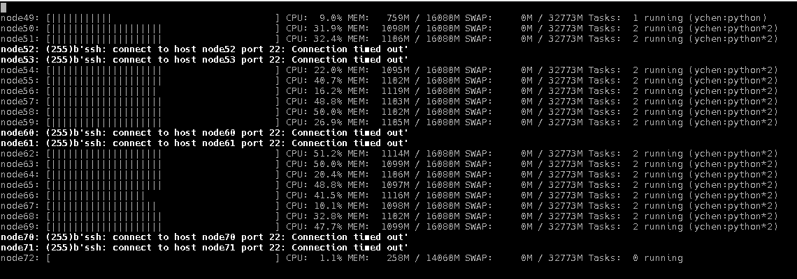

## Cluster top tool
`ctop_cpu.py`

A simple python tool combining ssh and top to display the cpu/ram usage of computing nodes.

## Dynamic MPI task distribution 
`MPI_taskpull2.py`

An MPI function to dynamically dsitribute tasks to workers. This will use one MPI process to be the master, resulting in n-1 available workers for a n-processor job.

## Helmholtz decomposition using fft
`solenoidal.py`

A python implementation of Helmholtz decomposition using fft. See Friedman et al. 2012, ApJ 746, 112 for example.

## Misc utilities
`util.py`

A collection of functions to scan directory and handle files.
